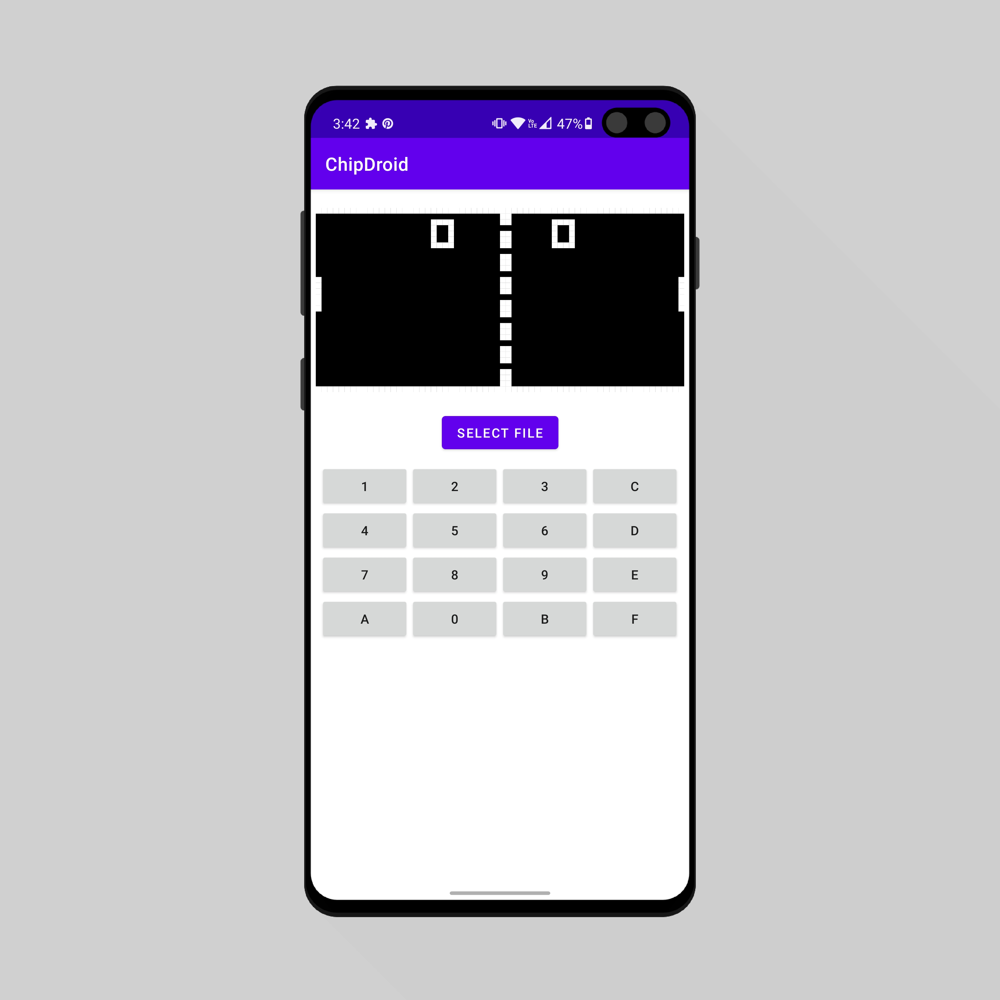
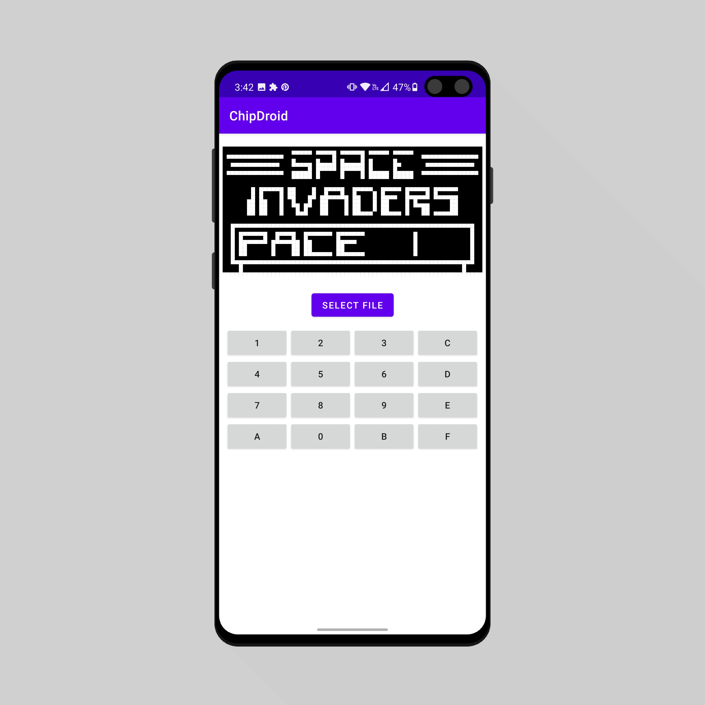

 

  
<h1 align="center">
    ChipDroid
</h1>
    <h3 align="center">
        An Android Chip-8 emulator
         
    </h3>
     
  

    
    

 

## About The Project

ChipDroid is a simple Android Chip-8 emulator written in Kotlin

## Built With

- Kotlin
- MVVM architecture
- Dagger Hilt

## Contribution

1. Fork it!
2. Create a branch for the feature you want to make: `git checkout -b my-new-feature`
3. Commit changes: `git commit -am 'Add some feature'`
4. Push to the branch: `git push origin my-new-feature`
5. Submit a pull request

## ☕ Like what I do?
 

## Contact

Fernando Maldonado - [@Fmaldonado4202](https://twitter.com/Fmaldonado4202) - fmaldonado824@gmail.com

Project Link: [https://github.com/Fmaldonado6/Akiyama](https://github.com/Fmaldonado6/Akiyama)
